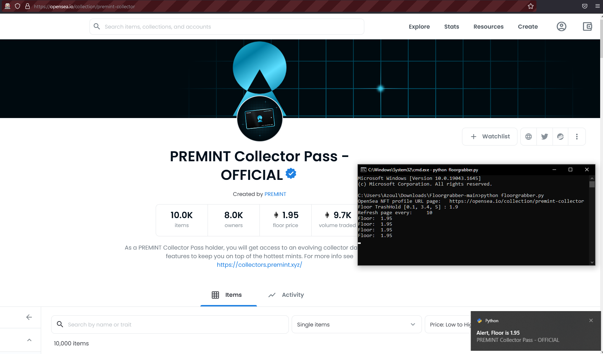

# OpenSea Floor RealTime Notifications.

This project was built so that one may follow a desired floor of an NFT at any moment by giving the "OpenSea NTF Profile URL."

## Requierments:

- Selenium - that is compatible with your Firefox  version
- win10toast - pip install win10toast
- Firefox lastest version
- gekodriver - Install this file in c:\webdrivers\gekodriver.exe
- Currently supports Windows only.

## Installation:

- python3 - https://www.microsoft.com/store/productId/9PJPW5LDXLZ5
- Selenium - open cmd and type pip install selenium OR python -m pip install selenium
- win10toast - open cmd and type pip install win10toast OR python -m pip install win10toast
- ### Download the project And save it somewhere https://github.com/Prim1Tive/Floorgrabber/releases/download/untagged-ea92eb196d54158ab008/floorgrabber.py
- gekodriver - https://github.com/mozilla/geckodriver/releases/download/v0.31.0/geckodriver-v0.31.0-win64.zip | please save the file at c:\webdrivers\gekodriver.exe

## Usage:

- 1 Run .py file
- 2 Give OpenSea URL
- 3 Give floor threshold
- 4 Sleep time

